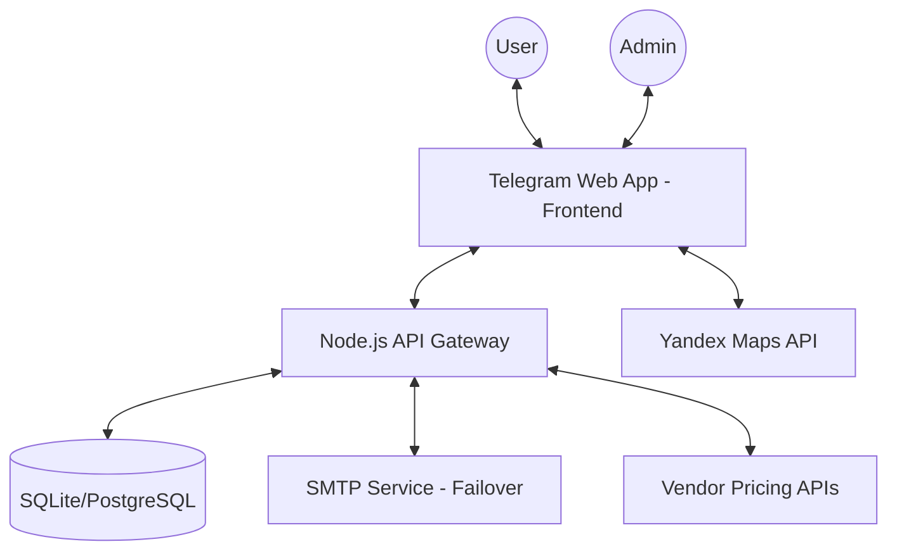

# Gaze TWA Architecture

## Component Interaction Scheme

### 1. Security Layer
- **Auth:** Every request from the frontend includes the `Telegram.WebApp.initData` in the `Authorization` header.
- **Validation:** The backend validates the `initData` using the Bot Token and HMAC-SHA256 algorithm to ensure the request is genuine and comes from the Telegram client.
- **CORS:** Restricted to the TWA domain.
- **Roles:** User and Admin roles are checked on the server side for protected routes (e.g., `/api/admin/*`).

### 2. Data Flow
- **Order Placement:**
    1. User completes the constructor.
    2. Frontend sends order data to `/api/order`.
    3. Backend validates data and saves to DB.
    4. Backend attempts to notify the bot/admin.
    5. **Failover:** If the primary notification fails, an email is sent via SMTP.
- **Pricing:**
    1. Frontend requests current prices from `/api/prices`.
    2. Backend fetches/caches prices from vendors and returns them.
- **Admin Panel:**
    1. Authenticated admins can update prices, block users, and monitor logs.
    2. Logs with "critical" status are highlighted in the UI.

### 3. Frontend (UX/UI)
- **Glassmorphism:** Modern UI with translucent backgrounds and blur effects.
- **Yandex.Maps:** Integrated for precise object location selection.
- **Support Chat:** Secured internal chat available only to clients with active or confirmed orders.

### 4. Database Schema
- `users`: id, telegram_id, role, username, blocked, block_reason.
- `orders`: id, user_id, items, total_price, address, status, created_at.
- `prices`: id, item_name, price, updated_at.
- `logs`: id, level, message, details, created_at.
